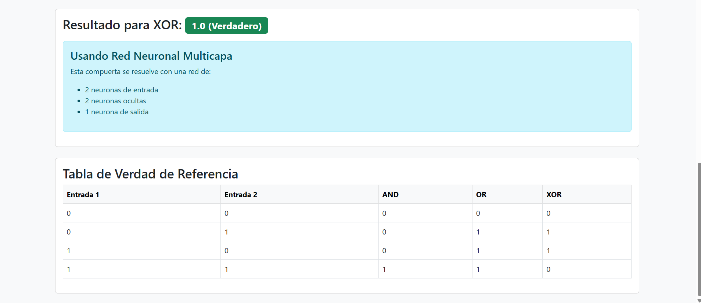

# Puertas Lógicas con Perceptrón y Red Neuronal Multicapa

Este proyecto es una aplicación web desarrollada con Django desde 0 que simula el funcionamiento de puertas lógicas 
(AND, OR y XOR) utilizando una neurona (perceptrón) para AND/OR y una red neuronal multicapa para solucionar el problema de la 
linealidad de XOR. También incluye un modelo 3D interactivo de una neurona en el navegador usando Three.js.

## Funcionalidades

- Interfaz web para seleccionar la compuerta lógica y entradas binarias.
- Visualización de resultados utilizando modelos de IA entrenados.
- Aviso en la interfaz cuando se usa la puerta lógica XOR de que se esta usando el MLP (multi-layer perceptron)
- Tabla de verdad para comparar los resultados esperados.
- Visualizador 3D animado e interactivo de una neurona con rotación automática.

## Tecnologías usadas

- **Backend**: Django (Python)
- **Modelos de IA**:
  - Perceptrón simple (`models.py`)
  - Red neuronal multicapa (`mlp.py`)
- **Frontend**:
  - Bootstrap 5
  - Three.js para el modelo 3D
- **HTML Templates**: `base.html`, `perceptron_form.html`

## Estructura del proyecto

perceptron_proyecto/
├── perceptron/
│   ├── __init__.py
│   ├── admin.py
│   ├── apps.py
│   ├── forms.py
│   ├── mlp.py                  # Red neuronal multicapa (XOR)
│   ├── models.py               # Perceptrón simple
│   ├── tests.py
│   ├── urls.py                 # Rutas de la app
│   ├── views.py                # Vista principal
│   ├── migrations/
│   ├── static/perceptron/
│   │   ├── neurona.fbx
│   │   └── neurona1.glb        # Modelo 3D de neurona
│   └── templates/
│       └── base.html
│       └── perceptron_form.html
│
├── perceptron_proyecto/
│   ├── __init__.py
│   ├── asgi.py
│   ├── settings.py
│   ├── urls.py                 # Enrutamiento general
│   └── wsgi.py

## ¿Cómo ejecutar el proyecto?

1. Tener Python 3 y Django instalados.
2. Instala las dependencias:

   pip install django numpy
   pip list  # comprobar

3. Ejecuta el servidor desde la carpeta del proyecto:

   cd perceptron_proyecto
   python manage.py runserver

4. Accede a la app desde el navegador poniendo:

    http://127.0.0.1:8000/

## Retos y Aprendizajes

Durante el desarrollo de este proyecto me he enfrentado a:

- **Integrar una red neuronal desde cero sin usar frameworks como TensorFlow o PyTorch**, me forcé a entender el funcionamiento de las capas, pesos, bias, y el algoritmo de retropropagación (backpropagation).

- **Resolver el caso de la compuerta XOR**, que no es linealmente separable (es decir, no se puede resolver con una sola línea recta como sí pasa con AND u OR). Esto me obligó a aprender sobre redes neuronales y usar una red multicapa (MLP) con una capa oculta.

- **Visualización 3D en el navegador**, otro reto fue usar Three.js, fue una experiencia totalmente nueva, para cumplir el capricho de ver una neurona 3D e interactuar con ella. Tuve que aprender a controlar la rotación, cámaras y manejar errores en la carga de recursos.

- **Diseñar un formulario interactivo con Django** que se conectara correctamente con la lógica del backend y los modelos entrenados en tiempo real.

## Demo en video

> Haz clic para ver el funcionamiento completo de la app.

## Capturas de pantalla

### 1. Visualización 3D de la neurona

### 2. Formulario de compuerta lógica 

### 3. Resultado de la predicción 

